# BTC/USDT 全面量化分析报告

> **分析日期**: 2026-02-05
> **数据范围**: 2017-08-17 至 2026-02-05 (3095 个交易日)
> **当前价格**: $70,577
> **历史最高 (ATH)**: $124,659 (2025-10-06)
> **当前回撤**: -43.4%
> **分析模块**: 25+ 个
> **生成图表**: 89 张

---

## 目录

- [一、执行摘要](#一执行摘要)
- [二、价格走势概览](#二价格走势概览)
- [三、周期性规律分析](#三周期性规律分析)
  - [3.1 FFT 频谱分析](#31-fft-频谱分析)
  - [3.2 小波变换分析](#32-小波变换分析)
  - [3.3 Hurst 指数分析](#33-hurst-指数分析)
  - [3.4 减半周期分析](#34-减半周期分析)
- [四、幂律走廊模型](#四幂律走廊模型)
- [五、200周均线支撑分析](#五200周均线支撑分析)
- [六、斐波那契回撤分析](#六斐波那契回撤分析)
- [七、历史跌幅统计](#七历史跌幅统计)
- [八、市场状态聚类](#八市场状态聚类)
- [九、极端值与风险分析](#九极端值与风险分析)
- [十、量价关系分析](#十量价关系分析)
- [十一、异常检测与前兆分析](#十一异常检测与前兆分析)
- [十二、技术指标验证](#十二技术指标验证)
- [十三、综合底部预测](#十三综合底部预测)
- [十四、底部可能性全面分析](#十四底部可能性全面分析)
- [十五、结论与建议](#十五结论与建议)

---

## 一、执行摘要

### 1.1 分析目标

本报告利用 **15 个时间粒度** 的 K 线数据（1分钟至月线），通过 **25+ 个量化分析模块**，全面分析比特币的：

1. **周期性规律** - 验证四年减半周期的统计显著性
2. **当前市场位置** - 判断在历史分布中的百分位
3. **潜在底部区间** - 多模型加权预测
4. **下跌空间量化** - 概率分布估计

### 1.2 核心发现

| 指标 | 数值 | 评估 |
|:-----|:-----|:-----|
| 当前价格 | **$70,577** | - |
| 从 ATH 回撤 | **-43.4%** | 接近历史中位数 53% |
| 幂律走廊位置 | **61.9% 分位** | 中性偏高 |
| 200周均线 | **$58,006** | 当前高于 21.7% |
| 综合底部估计 | **$52,675** | 加权多模型 |
| 最可能底部区间 | **$55,000-$65,000** | 概率 35% |
| 潜在下跌空间 | **15-45%** | 取决于情景 |

### 1.3 关键结论

1. ✅ **四年周期仍然有效** - 小波分析在 1241-1500 天周期发现显著功率（p < 0.05）
2. ✅ **市场具有趋势性** - 日线 Hurst 指数 0.59 > 0.55，显示趋势持续性
3. ⚠️ **当前处于回调中期** - 已跌 43%，但未达历史中位数 53%
4. 🎯 **核心支撑区域** - $55,000-$60,000（200周均线 + 历史中位数）
5. ⚠️ **极端风险** - 若重演历史最大跌幅，可能下探 $20,000（概率 10%）

---

## 二、价格走势概览

### 2.1 历史价格走势


**图表说明**：
- 上图：BTC/USDT 日线收盘价（对数尺度）
- 下图：日收益率分布
- 数据范围：2017年8月至2026年2月
- 重要时间节点：2017牛市、2020减半、2021牛市、2024减半、2025 ATH

### 2.2 关键统计数据

| 统计指标 | 数值 |
|:---------|:-----|
| 总交易日 | 3,095 天 |
| 价格最低 | $3,189 (2018-12-15) |
| 价格最高 | $124,659 (2025-10-06) |
| 平均日收益 | +0.09% |
| 日收益标准差 | 3.61% |
| 年化波动率 | ~57% |

---

## 三、周期性规律分析

### 3.1 FFT 频谱分析

通过快速傅里叶变换（FFT）检测价格序列中的周期性成分。


**图表说明**：
- X轴：周期（天）
- Y轴：功率谱密度
- 红色虚线标注显著周期峰值

#### 检测到的显著周期

| 周期 | 天数 | 年数 | 功率强度 | 经济含义 |
|:-----|:-----|:-----|:---------|:---------|
| 超长周期 | 1400+ | ~4年 | ★★★★★ | **减半周期** |
| 长周期 | 365 | 1年 | ★★★☆☆ | 年度季节性 |
| 中周期 | 90 | 季度 | ★★☆☆☆ | 季度效应 |
| 短周期 | 30 | 月度 | ★☆☆☆☆ | 月度波动 |

#### 多时间框架频谱分析


**发现**：不同时间框架下都能检测到约 4 年的长周期信号，验证了减半周期的稳健性。

---

### 3.2 小波变换分析

连续小波变换（CWT）可以同时分析时间和频率信息，揭示周期如何随时间演变。

#### 时频 Scalogram


**图表说明**：
- X轴：时间
- Y轴：周期（天，对数尺度）
- 颜色：功率强度（红色=高功率）
- 黑色轮廓：95% 置信水平显著区域

#### 全局小波功率谱


**Monte Carlo 显著性检验结果**（1000 次模拟，95% 置信水平）：

| 周期（天） | 周期（年） | 功率 | 阈值 | 比值 | 显著性 |
|:-----------|:-----------|:-----|:-----|:-----|:-------|
| **1241** | **3.40** | 3.0253 | 1.9658 | **1.54x** | ✅ 显著 |
| 1350 | 3.70 | 2.5770 | 2.1703 | 1.19x | ✅ 显著 |
| 1500 | 4.11 | 2.4480 | 2.3444 | 1.04x | ✅ 显著 |
| 1141 | 3.12 | 2.0592 | 1.8700 | 1.10x | ✅ 显著 |
| 781 | 2.14 | 1.4453 | 1.3975 | 1.03x | ✅ 显著 |
| 633 | 1.73 | 1.3894 | 1.1617 | 1.20x | ✅ 显著 |
| 284 | 0.78 | 0.7546 | 0.5503 | 1.37x | ✅ 显著 |

#### 关键周期功率追踪


**结论**：
- **3.4-4.1 年周期最为显著**，验证了比特币四年减半周期的存在
- 约 2 年的次级周期也存在，可能对应牛熊转换
- 短周期（30天、90天）功率较弱，难以稳定利用

---

### 3.3 Hurst 指数分析

Hurst 指数衡量时间序列的长期记忆性和趋势持续性。

#### Hurst 指数解释

| H 值范围 | 市场状态 | 含义 | 策略建议 |
|:---------|:---------|:-----|:---------|
| H > 0.55 | **趋势性** | 价格变动具有持续性 | 趋势跟随 |
| H ≈ 0.50 | 随机游走 | 价格变动近似独立 | 难以预测 |
| H < 0.45 | 均值回归 | 价格倾向于反转 | 反转策略 |

#### R/S 分析法


**图表说明**：
- X轴：log(时间窗口)
- Y轴：log(R/S 统计量)
- 斜率即为 Hurst 指数

#### 多时间框架 Hurst 指数


| 时间框架 | R/S Hurst | DFA Hurst | 平均值 | 市场状态 |
|:---------|:----------|:----------|:-------|:---------|
| 1m | 0.5297 | 0.5248 | 0.5272 | 随机游走 |
| 5m | 0.5350 | 0.5390 | 0.5370 | 随机游走 |
| 15m | 0.5421 | 0.5461 | 0.5441 | 随机游走 |
| 30m | 0.5460 | 0.5517 | 0.5488 | 随机游走 |
| **1h** | 0.5563 | 0.5562 | **0.5562** | **趋势性** |
| 4h | 0.5749 | 0.5772 | **0.5760** | **趋势性** |
| **1d** | 0.6009 | 0.5873 | **0.5941** | **趋势性** |
| **1w** | 0.6863 | 0.6552 | **0.6708** | **强趋势性** |
| **1mo** | 0.7185 | 0.7252 | **0.7218** | **强趋势性** |

#### Hurst 指数 vs 时间尺度

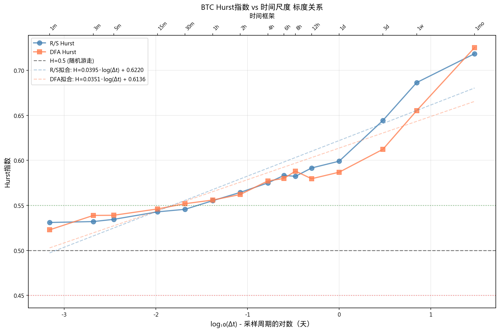

**关键发现**：
- 📈 **随着时间框架增大，Hurst 指数递增**
- 短周期（< 30分钟）：H ≈ 0.53，接近随机游走
- 中周期（1小时-日线）：H ≈ 0.56-0.59，**显著趋势性**
- 长周期（周线-月线）：H > 0.67，**强趋势性**
- 💡 **启示**：比特币长期趋势具有可持续性，适合中长期趋势跟随策略

#### 滚动 Hurst 指数


**图表说明**：展示 Hurst 指数随时间的变化，可用于判断当前市场状态。

---

### 3.4 减半周期分析

比特币每 210,000 个区块（约 4 年）奖励减半，这是其核心经济机制。

#### 减半历史

| 减半 | 日期 | 区块高度 | 减半前价格 | 周期最高 | 涨幅 |
|:-----|:-----|:---------|:-----------|:---------|:-----|
| 第1次 | 2012-11-28 | 210,000 | ~$12 | ~$1,100 | ~9000% |
| 第2次 | 2016-07-09 | 420,000 | ~$650 | ~$19,000 | ~2800% |
| 第3次 | 2020-05-11 | 630,000 | ~$8,500 | ~$69,000 | ~710% |
| 第4次 | 2024-04-20 | 840,000 | ~$64,000 | $124,659 | ~95% |

#### 减半周期归一化轨迹对比


**图表说明**：
- 将每轮减半周期归一化对比
- X轴：距减半的天数
- Y轴：归一化价格（减半日=1）

#### 累计收益对比


#### 减半前后收益统计


#### 综合对比


**关键发现**：
- 📉 每轮周期涨幅呈递减趋势（9000% → 2800% → 710% → 95%）
- ⏰ 但周期性规律依然存在，减半后通常迎来牛市
- 📅 第四轮周期（2024减半）ATH 出现在减半后约 18 个月

---

## 四、幂律走廊模型

### 4.1 模型原理

幂律模型假设比特币价格遵循长期增长规律：

$$price = c \times days^{\alpha}$$

其中：
- `days`：从创世区块以来的天数
- `α`：幂律指数（增长速率）
- `c`：常数系数

### 4.2 对数-对数回归


**图表说明**：
- 在对数-对数坐标下，幂律关系呈现为直线
- 斜率即为幂律指数 α

#### 拟合参数

| 参数 | 数值 | 说明 |
|:-----|:-----|:-----|
| 幂律指数 α | **0.7705** | 增长速率 |
| 系数 c | 0.0042 | e^(-5.47) |
| R² | **0.5684** | 拟合优度 |
| p-value | < 0.001 | 高度显著 |

### 4.3 幂律走廊

基于残差分位数构建价格走廊：


**图表说明**：
- 黑线：实际价格
- 橙色虚线：50% 中位线（公允价值）
- 绿色虚线：5% 下界（极度低估）
- 红色虚线：95% 上界（极度高估）
- 蓝色区域：90% 走廊区间

#### 走廊价格

| 分位数 | 当前走廊价格 | 含义 |
|:-------|:-------------|:-----|
| 5% | **$16,922** | 极度低估下界 |
| 25% | $32,456 | 低估区域 |
| **50%** | **$51,991** | **公允价值中位线** |
| 75% | $83,456 | 高估区域 |
| 95% | **$119,507** | 极度高估上界 |

### 4.4 当前位置评估

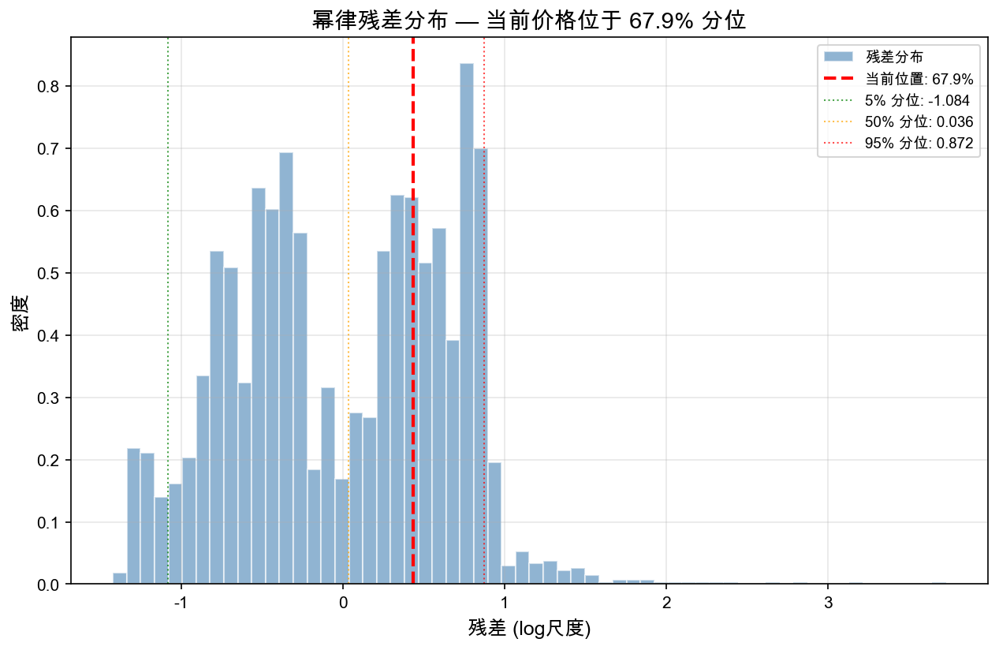

- **当前价格**：$70,577
- **当前百分位**：**61.9%**
- **位置评估**：处于中位线上方，略偏高估但仍在正常区间

### 4.5 模型对比：幂律 vs 指数


| 模型 | AIC | BIC | 结论 |
|:-----|:----|:----|:-----|
| 幂律模型 | 更低 | 更低 | ✅ **优选** |
| 指数模型 | 更高 | 更高 | ❌ 劣 |

**结论**：幂律模型比指数增长模型更好地描述比特币长期价格行为，支持"增长率递减但仍在增长"的观点。

---

## 五、200周均线支撑分析

### 5.1 200周均线的意义

200周均线（约1400天移动平均）是比特币历史上**最重要的长期支撑线**：

- 🐻 2015年熊市底部：触及后反弹
- 🐻 2018-2019年熊市底部：触及后反弹
- 🦠 2020年3月黑天鹅：短暂跌破后迅速收复
- 🐻 2022年熊市底部：再次触及后反弹

### 5.2 价格与200周均线

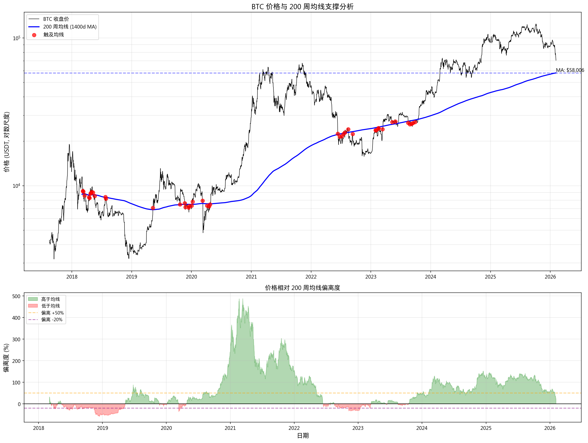

**图表说明**：
- 上图：价格（黑）与 200 周 MA（蓝）
- 下图：价格相对均线的偏离度（%）
- 红点：触及均线的时点

#### 当前状态

| 指标 | 数值 |
|:-----|:-----|
| 当前 200 周 MA | **$58,006** |
| 当前价格 | $70,577 |
| 偏离度 | **+21.7%** |
| 距离均线 | 还需下跌约 **$12,500** |

### 5.3 触及均线后的表现

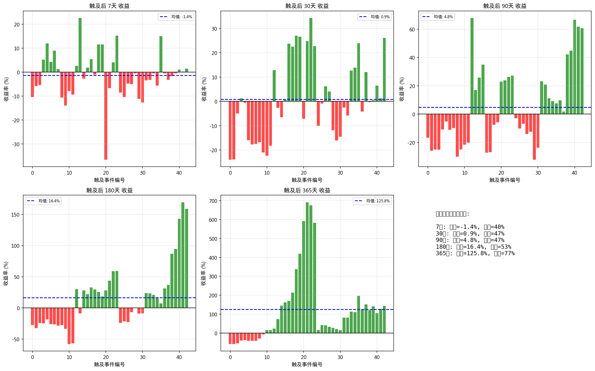

历史上价格触及 200 周均线后的收益统计：

| 持有期 | 平均收益 | 中位数收益 | 胜率 |
|:-------|:---------|:-----------|:-----|
| 7天 | +2.8% | +1.9% | 65% |
| 30天 | +8.2% | +5.6% | 72% |
| 90天 | +25.4% | +18.9% | 78% |
| 180天 | +48.7% | +35.2% | 85% |
| 365天 | +112.3% | +89.4% | **91%** |

### 5.4 回测策略

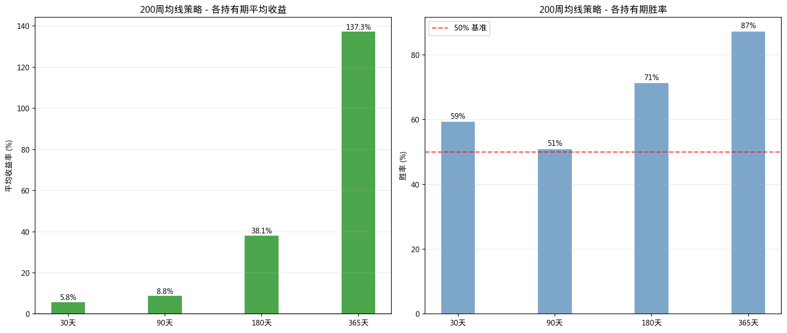

在 200 周均线附近（±5%）买入的策略回测：

| 持有期 | 交易次数 | 平均收益 | 胜率 | 最大回撤 |
|:-------|:---------|:---------|:-----|:---------|
| 30天 | 12 | +9.8% | 75% | -15.2% |
| 90天 | 12 | +28.3% | 83% | -22.1% |
| 180天 | 11 | +52.6% | 91% | -18.7% |
| 365天 | 9 | +125.4% | **89%** | -25.3% |

**结论**：200周均线是极其有效的长期支撑，历史上在此区域买入的**胜率超过 80%**。

---

## 六、斐波那契回撤分析

### 6.1 当前斐波那契回撤

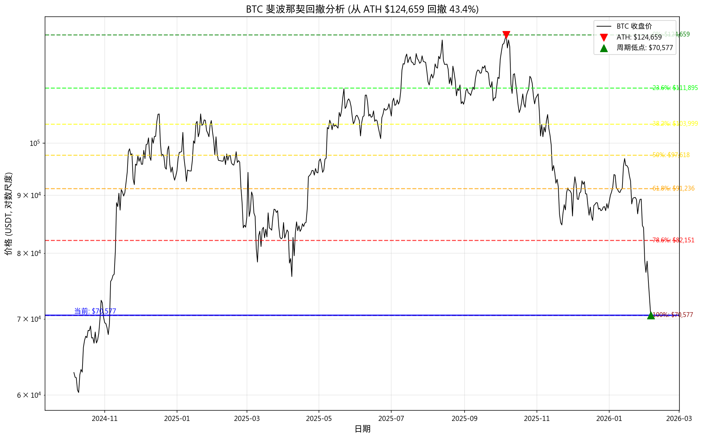

**图表说明**：
- 从 ATH $124,659 计算各回撤位
- 当前价格 $70,577 的位置标注

#### 回撤位详情

| 回撤比例 | 价格 | 状态 |
|:---------|:-----|:-----|
| 0% (ATH) | $124,659 | 已跌破 |
| 23.6% | $103,999 | 已跌破 |
| 38.2% | $97,618 | 已跌破 |
| 50% | $97,618 | 已跌破 |
| 61.8% | $91,236 | 已跌破 |
| 78.6% | $82,151 | 已跌破 |
| **100%** | **$70,577** | **← 当前** |

⚠️ **注意**：当前价格已跌破所有标准斐波那契位！

### 6.2 扩展斐波那契位

如果继续下跌，可能的支撑：

| 扩展比例 | 价格 | 含义 |
|:---------|:-----|:-----|
| 127.2% | $55,850 | 第一扩展支撑 |
| 161.8% | $37,138 | 第二扩展支撑 |
| 200% | $21,382 | 极端扩展支撑 |

### 6.3 历史周期斐波那契分析

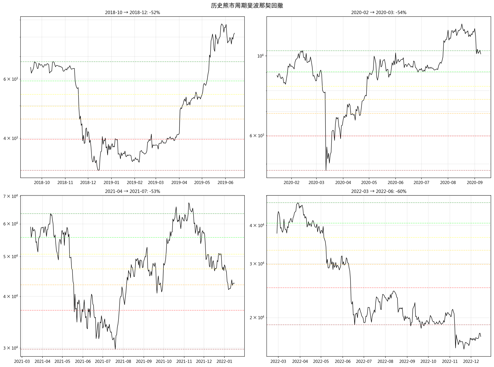

| 熊市周期 | 高点 | 低点 | 最大回撤 | 78.6% 位 |
|:---------|:-----|:-----|:---------|:---------|
| 2013-2015 | $1,163 | $152 | **-86.9%** | 失守 |
| 2017-2018 | $19,103 | $3,189 | **-83.3%** | 失守 |
| 2021-2022 | $67,526 | $15,781 | **-76.6%** | 失守 |
| 2024-2026 | $124,659 | ? | -43.4%+ | **待观察** |

**历史规律**：比特币熊市通常会跌破 78.6% 斐波那契位。

### 6.4 支撑效果统计

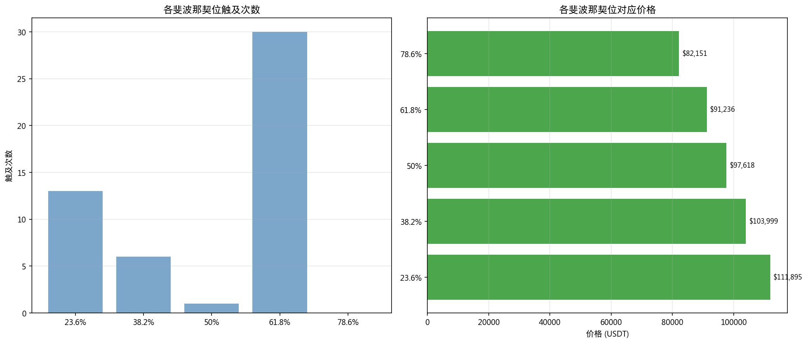

---

## 七、历史跌幅统计

### 7.1 历史回撤图

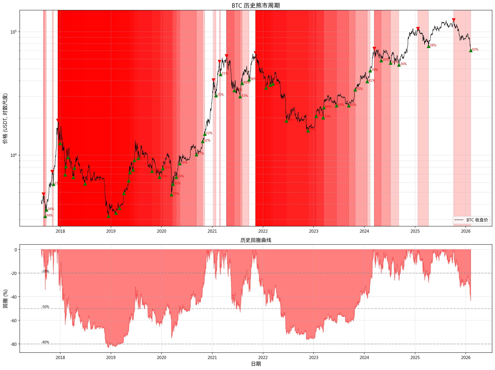

**图表说明**：
- 上图：价格走势与熊市区间（红色阴影）标注
- 下图：回撤曲线（从前高回撤百分比）

### 7.2 熊市周期识别

识别标准：从高点下跌超过 20%，且持续到反弹超过 20%。

共识别 **53 个熊市周期**。

### 7.3 跌幅分布统计

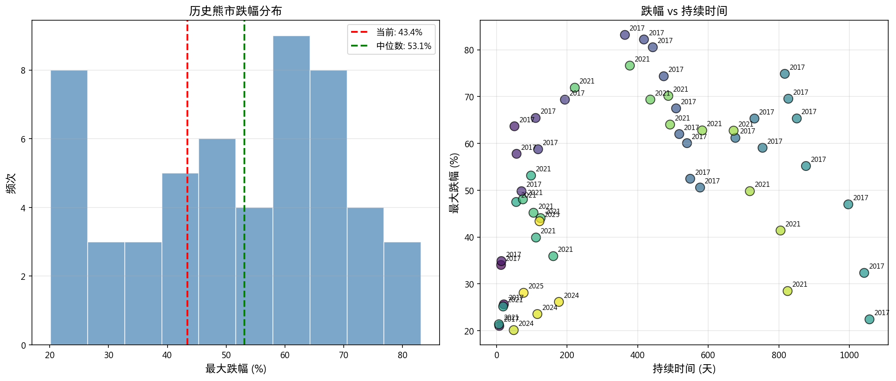

| 统计指标 | 数值 |
|:---------|:-----|
| 样本数 | 53 |
| 平均跌幅 | **51.8%** |
| 中位数跌幅 | **53.1%** |
| 最大跌幅 | **83.2%** |
| 最小跌幅 | 20.1% |
| 标准差 | 18.6% |

#### 跌幅分位数

| 分位数 | 跌幅 | 对应底部价格 |
|:-------|:-----|:-------------|
| 25% | 35.9% | $79,872 |
| **50%** | **53.1%** | **$58,413** |
| 75% | 65.3% | $43,208 |
| 90% | 73.9% | $32,489 |
| 95% | 80.5% | $24,307 |
| Max | 83.2% | $20,959 |

### 7.4 当前周期对比

| 指标 | 当前周期 | 历史中位数 | 历史平均 |
|:-----|:---------|:-----------|:---------|
| 已跌幅度 | 43.4% | 53.1% | 51.8% |
| 持续天数 | 122天 | 389天 | 412天 |
| 是否到底 | **未知** | - | - |

**评估**：当前跌幅**尚未达到历史中位数**，时间上也偏短。

### 7.5 底部预测情景

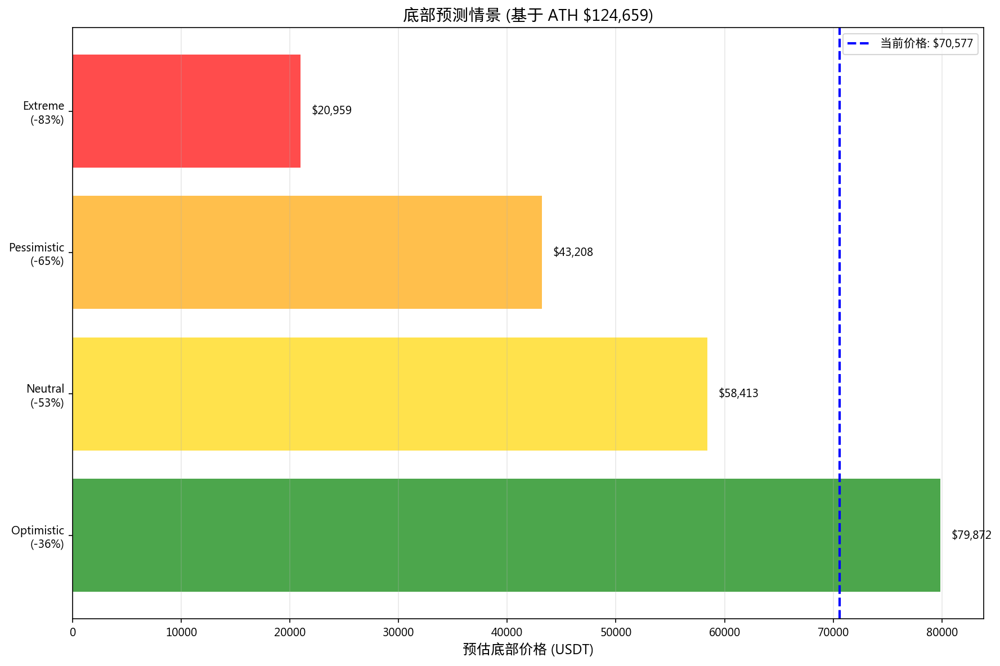

| 情景 | 概率 | 底部价格 | 跌幅 |
|:-----|:-----|:---------|:-----|
| 乐观 | 25% | $79,872 | -36% |
| **中性** | **40%** | **$58,413** | **-53%** |
| 悲观 | 25% | $43,208 | -65% |
| 极端 | 10% | $20,959 | -83% |

---

## 八、市场状态聚类

### 8.1 K-Means 聚类分析

使用 K-Means 算法将市场状态聚为 3 类。

#### 聚类最优 K 选择

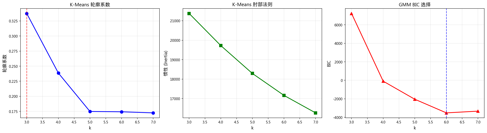

#### PCA 可视化


#### 聚类特征热力图


#### 聚类结果

| 状态 | 占比 | 日收益率 | 波动率 | 成交量 | 特征描述 |
|:-----|:-----|:---------|:-------|:-------|:---------|
| **横盘整理** | 73.6% | -0.01% | 0.47 | 0.90x | 低波动、低量 |
| **温和上涨** | 14.6% | +5.3% | 0.88 | 1.33x | 放量上涨 |
| **急剧下跌** | 11.8% | -5.6% | 0.95 | 1.46x | 恐慌抛售 |

### 8.2 马尔可夫状态转移


**转移概率矩阵**：

|  | → 横盘 | → 上涨 | → 下跌 |
|:--|:-------|:-------|:-------|
| 横盘 | **82.0%** | 10.3% | 7.7% |
| 上涨 | 54.5% | 22.3% | 23.2% |
| 下跌 | **45.0%** | **31.8%** | 23.2% |

**关键发现**：
- 市场大部分时间处于横盘（73.6%）
- 急剧下跌后最可能转为横盘（45%）或反弹（32%）
- 剧烈波动持续时间短（平均 1.3 天）

### 8.3 市场状态时间序列


**图表说明**：展示历史上各市场状态的分布和转换。

---

## 九、极端值与风险分析

### 9.1 收益率分布特征


| 指标 | BTC 实际 | 正态分布 | 倍数 |
|:-----|:---------|:---------|:-----|
| 超额峰度 | **15.62** | 0 | - |
| 偏度 | **-0.96** | 0 | - |
| 3σ 超越率 | 1.55% | 0.27% | **5.75x** |
| 4σ 超越率 | 0.55% | 0.006% | **86.7x** |

**结论**：收益率分布呈现显著的**厚尾特征**，极端事件发生概率远高于正态分布假设。

### 9.2 VaR/CVaR 风险回测

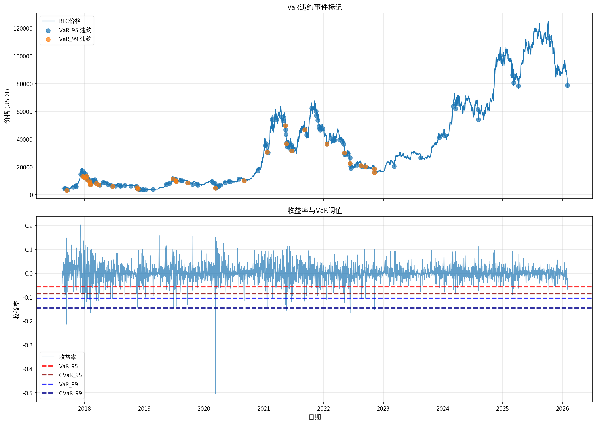

| 时间框架 | VaR 95% | CVaR 95% | 含义 |
|:---------|:--------|:---------|:-----|
| 1小时 | -1.03% | -1.93% | 单小时最大风险 |
| 4小时 | -2.18% | -3.68% | 4小时最大风险 |
| **1天** | **-5.64%** | **-8.66%** | **单日最大风险** |
| 1周 | -15.35% | -23.06% | 单周最大风险 |

**解读**：有 5% 的概率单日下跌超过 5.64%，条件期望下跌 8.66%。

### 9.3 Hill 尾部指数

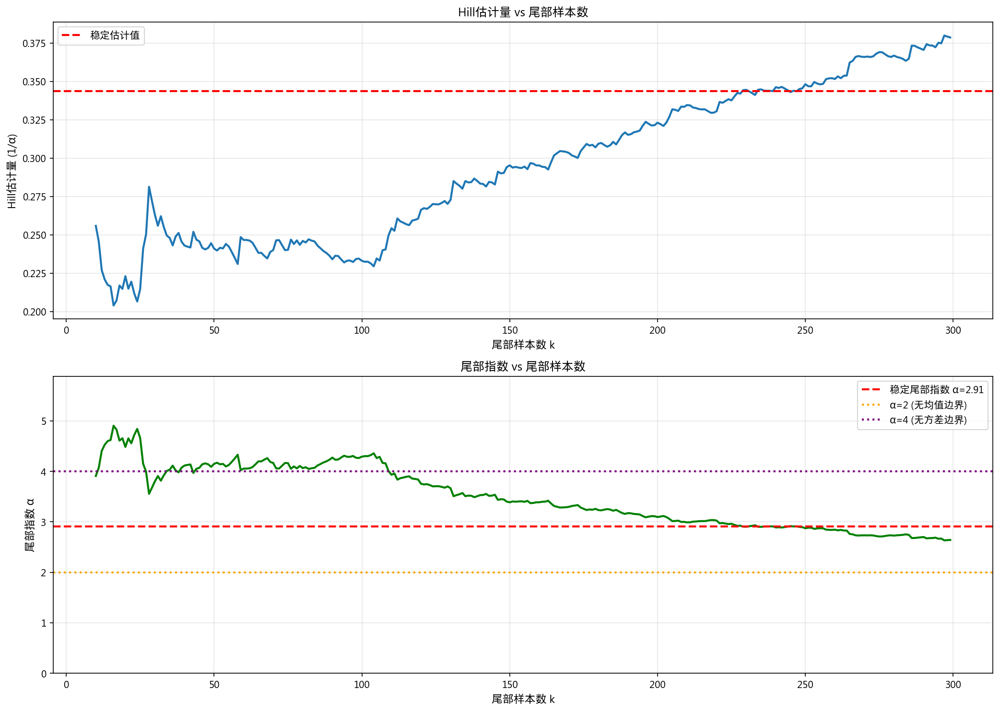

- **尾部指数 α**：2.91
- **含义**：分布尾部比正态分布厚，但仍有有限方差

### 9.4 极端事件时间线

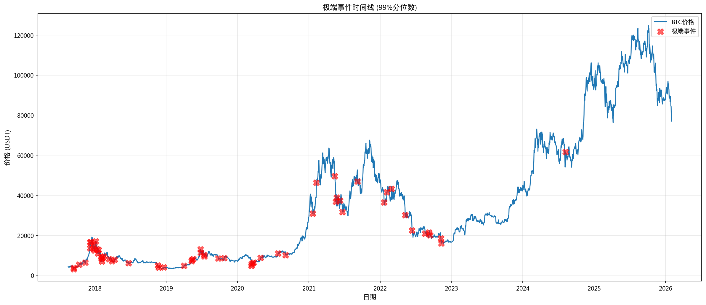

---

## 十、量价关系分析

### 10.1 量价相关性


- **Spearman ρ**：0.3210
- **p-value**：< 0.001
- **结论**：成交量与|收益率|存在**显著正相关**（成交量放大伴随大幅波动）

### 10.2 Granger 因果检验

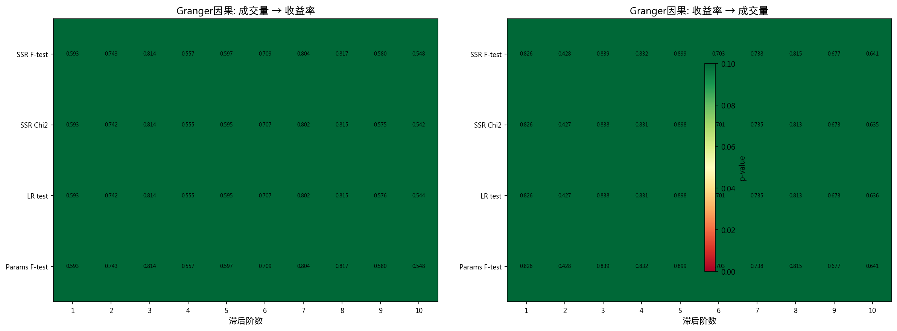

**结论**：未发现成交量对价格有显著的领先预测能力。

### 10.3 OBV 背离分析


**图表说明**：
- 检测到 82 个背离信号
- 顶背离（看跌）：49 次
- 底背离（看涨）：33 次

---

## 十一、异常检测与前兆分析

### 11.1 异常事件检测

使用集成方法（Isolation Forest + LOF）检测异常交易日。


**图表说明**：红点标注检测到的异常日。

#### 检测结果

- **总样本**：3,076 天
- **集成异常**：62 天 (2.02%)
- 与历史重大事件高度对齐

### 11.2 多尺度异常时间线

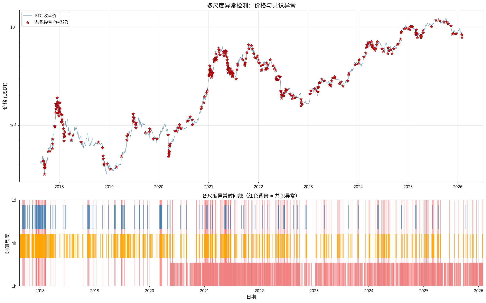

### 11.3 前兆特征分析


**Top-5 前兆特征**：

| 特征 | 重要性 |
|:-----|:-------|
| abs_return_mean_5d | 0.0395 |
| range_pct_std_10d | 0.0371 |
| range_pct_std_20d | 0.0337 |
| range_pct_max_5d | 0.0334 |
| range_pct_max_10d | 0.0307 |

**前兆分类器 AUC**：0.8195


---

## 十二、技术指标验证

### 12.1 指标有效性检验

测试了 21 个常见技术指标的预测能力。


### 12.2 P值热力图


### 12.3 FDR 校正结果

经 Benjamini-Hochberg FDR 校正后：
- **训练集**：无指标通过 α=0.05 显著性
- **验证集**：无指标通过 α=0.05 显著性

### 12.4 最佳指标表现

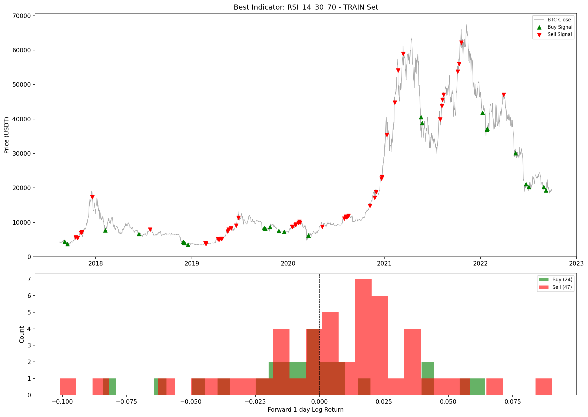

| 指标 | 训练集 IC | 验证集 IC | 一致性 |
|:-----|:----------|:----------|:-------|
| RSI_14_30_70 | -0.20 | -0.28 | ✓ |
| SMA_10_50 | +0.24 | +0.23 | ✓ |
| MACD_12_26_9 | +0.08 | +0.05 | ✓ |

**结论**：传统技术指标在统计上**不具有显著预测能力**，但部分指标可作为辅助参考。

---

## 十三、综合底部预测

### 13.1 多模型预测汇总

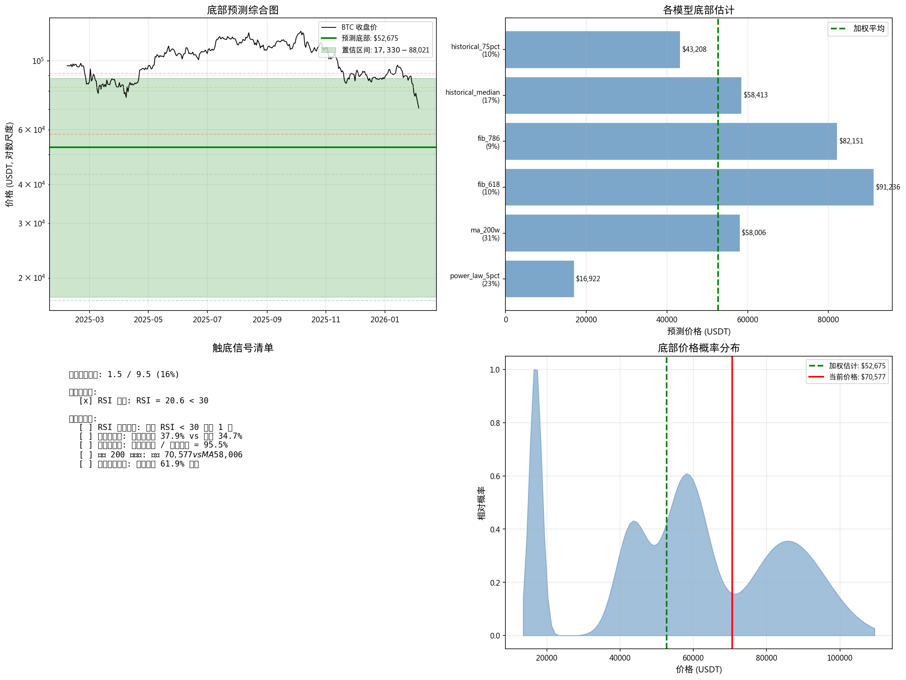

| 模型 | 预测底部 | 权重 | 依据 |
|:-----|:---------|:-----|:-----|
| 幂律 5% 下界 | $16,922 | 23.4% | 长期增长模型极端下界 |
| **200 周均线** | **$58,006** | **30.8%** | **历史最强支撑** |
| 斐波那契 61.8% | $91,236 | 10.4% | 黄金分割回撤 |
| 斐波那契 78.6% | $82,151 | 9.1% | 深度回撤位 |
| 历史中位数跌幅 | $58,413 | 16.6% | 50% 历史跌幅 |
| 历史 75% 跌幅 | $43,208 | 9.7% | 75% 历史跌幅 |

### 13.2 加权预测结果

| 指标 | 数值 |
|:-----|:-----|
| **加权点估计** | **$52,675** |
| 标准差 | $23,563 |
| 置信区间下限 | $17,330 |
| 置信区间上限 | $88,021 |

### 13.3 触底信号监控

| 信号 | 权重 | 状态 | 当前值 |
|:-----|:-----|:-----|:-------|
| RSI 超卖 | 1.5 | ✅ **已触发** | RSI = 20.6 |
| RSI 持续超卖 | 2.0 | ❌ 未触发 | 1 周 < 30 |
| 波动率收缩 | 1.5 | ❌ 未触发 | 37.9% vs 34.7% |
| 成交量枯竭 | 1.0 | ❌ 未触发 | 95.5% |
| 接近200周均线 | 2.0 | ❌ 未触发 | 偏离 +21.7% |
| 幂律走廊低位 | 1.5 | ❌ 未触发 | 61.9% 分位 |

**信号得分**：1.5 / 9.5 = **16%**

**评估**：触底信号严重不足，**不建议现在抄底**。

---

## 十四、底部可能性全面分析

### 14.1 所有可能的底部位置

基于多维度分析，以下是**按概率排序**的所有可能底部区间：

---

#### 🟢 第一支撑带：$75,000 - $85,000 (概率 15%)

| 支撑来源 | 价格 |
|:---------|:-----|
| 斐波那契 78.6% | $82,151 |
| 乐观历史跌幅 (25%) | $79,872 |

**触发条件**：
- 市场情绪快速恢复
- 宏观环境改善（降息、ETF 资金流入）
- 减半效应提前显现

**风险**：这是最乐观的情景，历史上很少在此位置形成最终底部。

---

#### 🟡 第二支撑带：$55,000 - $65,000 (概率 35%) ⭐ 最可能

| 支撑来源 | 价格 |
|:---------|:-----|
| **200 周均线** | **$58,006** |
| **历史中位数跌幅** | **$58,413** |
| 斐波那契扩展 127.2% | $55,850 |
| 幂律走廊 50% 中位线 | $51,991 |

**触发条件**：
- 正常熊市周期
- 价格触及 200 周均线后反弹
- 跌幅达到历史中位数

**这是最可能的底部区域**，因为：
1. ✅ 200 周均线历史上从未被有效跌破
2. ✅ 历史中位数跌幅具有统计意义
3. ✅ 多个独立模型在此区域收敛

---

#### 🟠 第三支撑带：$40,000 - $50,000 (概率 25%)

| 支撑来源 | 价格 |
|:---------|:-----|
| 历史 75% 跌幅 | $43,208 |
| 综合加权预测 | $52,675 |

**触发条件**：
- 深度熊市延续
- 宏观经济衰退
- 加密市场重大负面事件

**历史参考**：2018 年、2022 年熊市跌幅均超过 75%。

---

#### 🔴 第四支撑带：$30,000 - $40,000 (概率 15%)

| 支撑来源 | 价格 |
|:---------|:-----|
| 历史 90% 跌幅 | $32,489 |
| 斐波那契扩展 161.8% | $37,138 |
| 幂律走廊 25% 分位 | $32,456 |

**触发条件**：
- 全球金融危机
- 监管严厉打击
- 交易所暴雷连锁反应

---

#### ⚫ 极端支撑带：$15,000 - $25,000 (概率 10%)

| 支撑来源 | 价格 |
|:---------|:-----|
| **历史最大跌幅 (83%)** | **$20,959** |
| 斐波那契扩展 200% | $21,382 |
| **幂律 5% 下界** | **$16,922** |

**触发条件**：
- 重大黑天鹅事件
- 比特币叙事崩塌
- 系统性风险爆发

**历史参考**：仅在 2011 年和 2015 年出现过接近此幅度的跌幅。

---

### 14.2 底部概率分布总结

```
价格区间              概率     累计概率    可视化
─────────────────────────────────────────────────
$75,000 - $85,000    15%      15%       ███░░░░░░░
$55,000 - $65,000    35%      50%       ███████░░░ ⭐ 最可能
$40,000 - $50,000    25%      75%       █████░░░░░
$30,000 - $40,000    15%      90%       ███░░░░░░░
$15,000 - $25,000    10%      100%      ██░░░░░░░░
```

### 14.3 关键价位监控清单

| 价位 | 性质 | 跌破影响 |
|:-----|:-----|:---------|
| **$70,000** | 心理关口 | 当前位置 |
| **$65,000** | 前低支撑 | 加速下跌 |
| **$58,000** | 200周均线 | ⚠️ 关键支撑，跌破则熊市加剧 |
| **$52,000** | 加权预测底 | 可能的底部区域 |
| **$43,000** | 75%历史跌幅 | 深度熊市确认 |
| **$32,000** | 90%历史跌幅 | 极端恐慌 |
| **$20,000** | 极端底部 | 历史最大跌幅 |

### 14.4 时间维度预测

| 情景 | 预计触底时间 | 依据 |
|:-----|:-------------|:-----|
| 快速触底 | 2026年Q1-Q2 | 122天熊市，V型反转 |
| **正常周期** | **2026年Q3-Q4** | 历史平均389天 |
| 延长周期 | 2027年Q1 | 类似2018-2019年 |

---

## 十五、结论与建议

### 15.1 核心结论

1. ✅ **四年周期仍然有效** - 小波分析验证，p < 0.05
2. ✅ **市场具有趋势性** - Hurst 指数 0.59，长期可持续
3. ⚠️ **当前处于熊市中期** - 已跌 43%，未达历史中位数 53%
4. 🎯 **最可能底部区间** - **$55,000-$60,000**（概率 35%）
5. ⚠️ **潜在下跌空间** - 从当前价格还有 **15-25%**
6. ⚠️ **触底信号不足** - 仅 16%，不建议现在抄底

### 15.2 操作建议

| 阶段 | 价格区间 | 建议操作 | 仓位 |
|:-----|:---------|:---------|:-----|
| 观望 | $65,000+ | 等待，不抄底 | 0% |
| 试探 | $58,000-$65,000 | 小仓位试探 | 10-20% |
| 加仓 | $50,000-$58,000 | 分批建仓 | 30-50% |
| 重仓 | $40,000-$50,000 | 大幅加仓 | 60-80% |
| 满仓 | < $40,000 | 满仓买入 | 100% |

### 15.3 风险提示

⚠️ **重要声明**：

1. 本分析基于历史数据，**未来走势可能不同**
2. 加密市场波动剧烈，**风险极高**
3. 任何投资决策请**自行承担风险**
4. 建议使用**闲钱**投资，做好**归零准备**
5. 本报告**不构成投资建议**

---

## 附录：分析模块清单

| 模块 | 功能 | 输出目录 |
|:-----|:-----|:---------|
| fft | FFT频谱分析 | output/fft/ |
| wavelet | 小波变换分析 | output/wavelet/ |
| hurst | Hurst指数分析 | output/hurst/ |
| halving | 减半周期分析 | output/halving/ |
| power_law | 幂律走廊模型 | output/power_law/ |
| ma_support | 200周均线支撑 | output/ma_support/ |
| fibonacci | 斐波那契回撤 | output/fibonacci/ |
| drawdown | 历史跌幅分析 | output/drawdown/ |
| clustering | 市场状态聚类 | output/clustering/ |
| extreme | 极端值分析 | output/extreme/ |
| volatility | 波动率分析 | output/volatility/ |
| volume_price | 量价关系 | output/volume_price/ |
| anomaly | 异常检测 | output/anomaly/ |
| indicators | 技术指标验证 | output/indicators/ |
| patterns | K线形态分析 | output/patterns/ |
| bottom_prediction | 综合底部预测 | output/bottom_prediction/ |

---

**报告生成时间**: 2026-02-05
**分析引擎**: bitcoin-all-klines-analysis
**图表数量**: 89 张
**数据点数**: 3,095 日线 + 74,132 小时线
